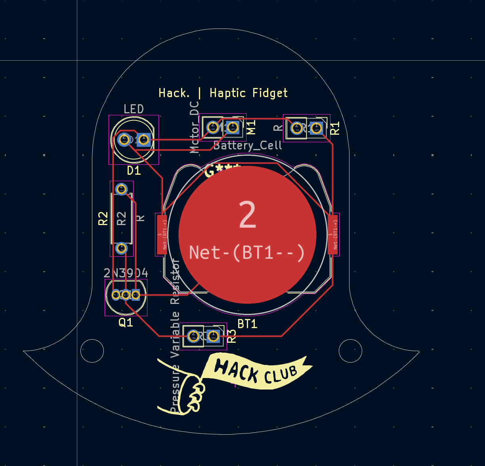

# haptic-thing
Haptic fidget for Hack Club's Solder! 

First time making PCB, might as well make it something I can play with. This is supposed to be a handheld toy where you can tap a membrane and the entire thing will vibrate!

## BOM
- Thin Film Pressure Resistor
- LED
- Haptic Motor
- Battery Holder/Battery
- Resistor(220 ohm)
- Resistor(2k ohm)
- NPN Transistor

## 3D View

## PCB

## Schematic

## Slack
U08F1KG2YFK @doge
